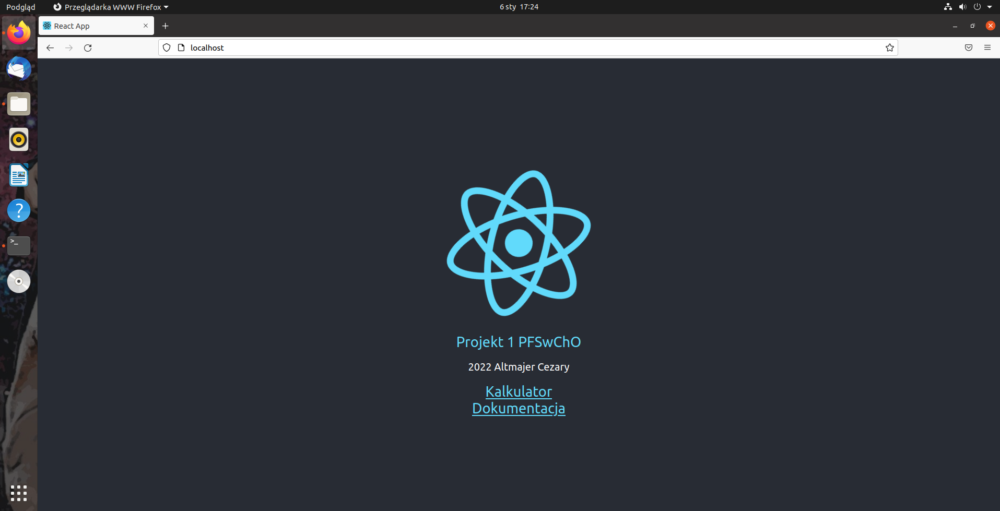

# Projekt 1 PFSwChO

## Aplikacja została stworzona na podstawie zadania 10

## Zrzut ekranu

## Uruchomienie usługi
Aby uruchomić usługę należy wykorzystać polecenie:

`COMPOSE_DOCKER_CLI_BUILD=1 DOCKER_BUILDKIT=1 docker compose -f docker-compose.dev.yml up --build`

Aplikacja uruchamia się na porcie 80.

### Dodano:
- Main.js - komponent strony głównej
- Documentation.js - komponent wyświetlający dokumentację
- History.js - komponent wyświetlający historię ostatnich 10 wprowadzanych wartości
           
### Zmodyfikowano:
**client:**
- Fib.js - dodano metody umożliwiające interakcję z modułem historii
- App.js - zrealizowano w formie routera React
**worker:**
- index.js - zmieniono funkcję obliczającą k-ty wyraz ciągu

